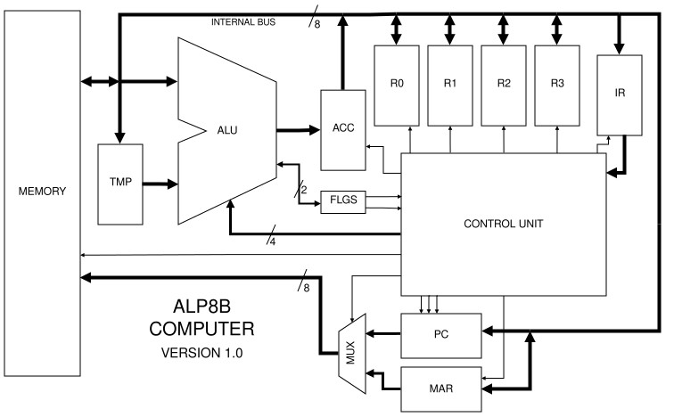

# ALP8B Computer
Alp(er's) 8-B(it) Computer



NOTE: As of 23/07/2026 this project is not yet finalised! (still writing a few more sample programs)

## What Is This?

A custom 8-bit ISA and simulated computer hardware project built during semester break.

### Highlights
- Fully custom 8-bit ISA with 23 instructions
- Classic Von Neumann architecture
- 256 Bytes of RAM & 4 general-purpose registers
- Built and simulated in [Digital](https://github.com/hneemann/Digital) (by Hneemann)
- Packed with raw, unfiltered, and naive hardware/ISA design choices

**Full documentation on the computer is located in [`documentation.pdf`](./documentation.pdf). Please read this for a more serious overview of the implementation and learnings I have gathered from this project.**

## Why Make This?

Couple of reasons:
- I've always been interested in computer architecture
- "What I cannot create, I do not understand" - Richard Feynman
- For fun, it was kind of like playing Factorio
- I thought this would be a good beginner project before moving on better and more powerful computers

## Quick Start

1. Download and install [Digital](https://github.com/hneemann/Digital).
2. Open `cpu.dig` under `simulation/`.
3. In Digital, navigate to: `Edit -> Circuit Specific Settings -> Advanced -> Program File`
4. Select the path of any given `.hex` file compiled with `assembler.py`. Sample programs can be found in [programs](./programs/)
5. To view program output, right click the EEPROM component during runtime, or press `F6` for overview on current register data values.

## Sample Programs

- **Fibonacci:** Calculates the first 10 Fibonacci numbers after '1' and places them in RAM 0xF0 onwards.
- **Fibonacci16:** Calculates the first 25 Fibonacci numbers. Uses 2 bytes per number to allow for the larger Fibonacci numbers to be computed. Implemented via a moving two pointer moving window approach.
- TBD

## Repository Structure

```text
.
├── images/                 # Diagrams
├── microcode/              # Python based microcode generator
├── programs/               # Premade sample programs
│   ├── fibonacci16/
│   └── ...
├── simulation/             # Simulation files
├── assembler.py            # Python based assembler used to write ALP8B software
├── documentation.pdf       # The real documentation
└── README.md               # This file
```

## License

MIT